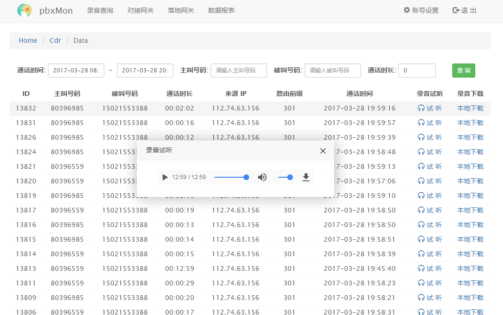

基于 FreeSWITCH 的 pbx 网关，内置录音质检系统，通话记录采用 mod_json_cdr 模块 + Web API 存储



### 服务器环境

- 操作系统: CentOS 7.2
- PBX系统： FreeSWITCH 1.6.15
- 数据库 :  MariaDB 5.5
- PHP框架:  Yaf 2.3.5

### 相关目录说明:
```
cdr             通话记录 API 接口，安装位置 /var/cdr
www             后台 Web 管理系统，安装位置 /var/www
config          Nginx、PHP 和 FreeSWITCH 的配置文件
scripte         MySQL 数据库表 SQL 文件
package         Yaf 框架以及相关软件包
```

### 默认 Web 后台账号/密码:
```
Account : admin
Password: pbxmon
```
